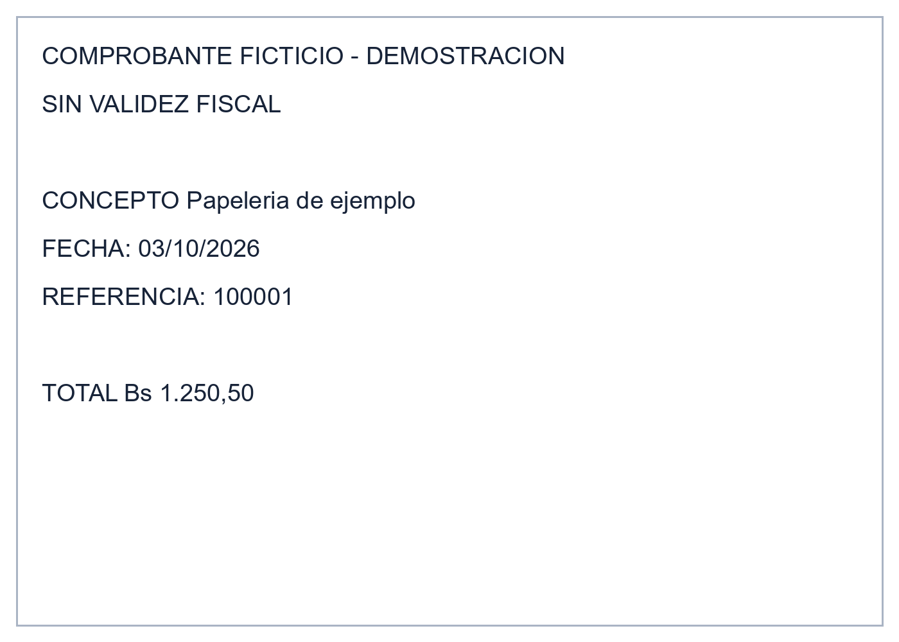
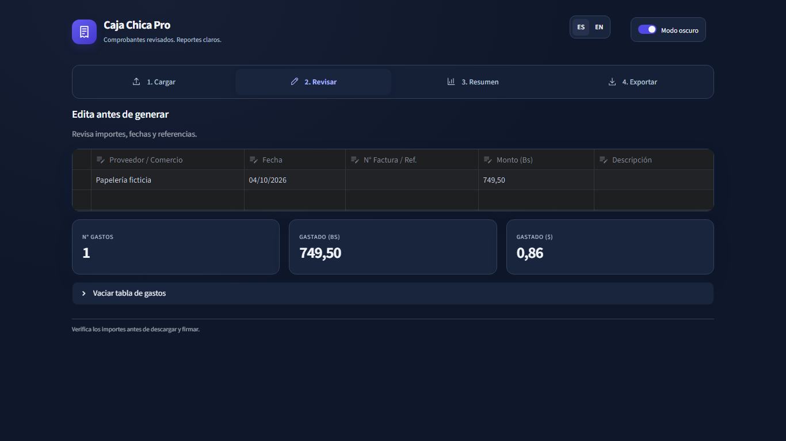
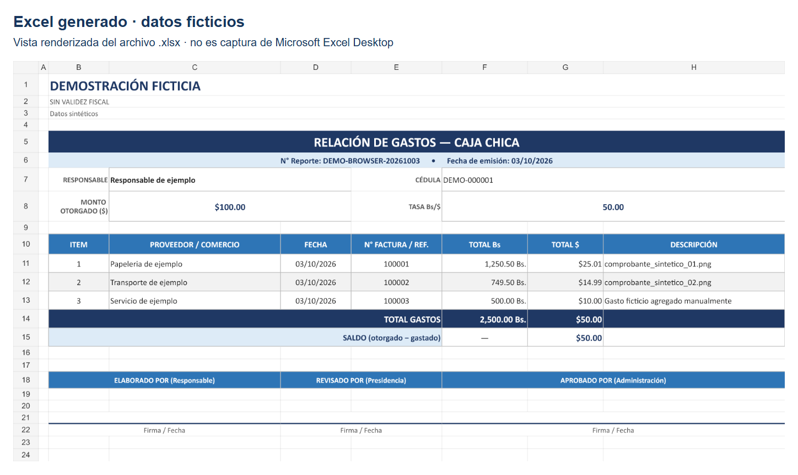

# Automatizated Petty Cash

Aplicación Python/Streamlit para preparar una relación de gastos de caja chica. La interfaz local se llama **Caja Chica Pro**: carga imágenes, extrae campos mediante OCR, permite revisarlos y corregirlos o ingresar gastos manualmente y genera una planilla Excel propia por código.

## Flujo

1. Introduce responsable, cédula, monto otorgado, fecha de emisión y tasa Bs/USD.
2. Carga comprobantes PNG, JPG, JPEG o WEBP y procesa con OCR, o agrega gastos manualmente.
3. Revisa proveedor, fecha, referencia, importe y descripción. Las fechas deben existir y usar `dd/mm/aaaa`.
4. Consulta el resumen y genera el Excel. El archivo incluye conversiones, totales, saldo y espacios para firmas.
5. Revisa el archivo antes de utilizarlo. Cambiar la tasa en **F8** modifica las fórmulas de conversión a USD.

La tasa la introduce el usuario; la aplicación no consulta una cotización automática. La planilla se construye con `openpyxl`, sin depender de `base/caja_chica_base.xlsx`. Los campos de texto introducidos por el usuario se guardan como texto literal en las celdas, preservando las fórmulas propias de cálculo.

## Demo con datos ficticios

Estas imágenes proceden de una ejecución local. No contienen comprobantes reales, clientes ni datos personales reales.

### Comprobante sintético



### Revisión y corrección en la app

El comprobante ficticio contiene un total de 749,50 Bs y una comisión incluida de 25,00 Bs. La tabla permite revisar los campos extraídos y corregirlos antes de exportar; el OCR puede requerir supervisión según el formato y la calidad de cada imagen.



### Excel generado

Con tres gastos de 1.250,50, 749,50 y 500 Bs, el total fue 2.500 Bs. A una tasa ficticia de 50 Bs/USD, el gasto fue 50 USD y el saldo 50 USD sobre un fondo de 100 USD.



## Ejecutar localmente en Windows

Desde la raíz del proyecto, usa un entorno virtual. Si `.venv` ya existe y funciona, reutilízalo.

```powershell
# Solo si aún no existe el entorno
python -m venv .venv

# Dependencias de la aplicación
.\.venv\Scripts\python.exe -m pip install -r requirements.txt

# Iniciar la app; abrir la dirección que muestre Streamlit
.\.venv\Scripts\python.exe -m streamlit run app.py
```

Estas son instrucciones de preparación; esta revisión reutilizó las dependencias existentes. El entorno probado fue Python 3.14.6, Streamlit 1.63.0, pandas 3.0.5, openpyxl 3.1.5, Pillow 12.3.0 y pytesseract 0.3.13.

### Motor OCR

`pytesseract` es un adaptador Python: también necesita el ejecutable de **Tesseract** y sus modelos de idioma. Consulta la [documentación de instalación de Tesseract](https://tesseract-ocr.github.io/tessdoc/Installation.html) y, para Windows, los [instaladores de UB Mannheim](https://github.com/UB-Mannheim/tesseract/wiki).

La función OCR solicita `spa+eng`. Para utilizar ambos idiomas, Tesseract debe disponer de los modelos `spa` y `eng`. `packages.txt` declara el motor y el paquete de idioma español para Streamlit Community Cloud. En Windows local, confirma que ambos modelos estén instalados con `tesseract --list-langs`. La prueba local anterior usó Tesseract 5.4.0 con `eng`; no verificó el modelo español.

Si el ejecutable no está en PATH, añade su carpeta **solo a la sesión de PowerShell que ejecuta la app**. Este ejemplo corresponde a la instalación local utilizada; adapta la carpeta si instalaste Tesseract en otro lugar.

```powershell
$tesseractDir = Join-Path $env:LOCALAPPDATA 'Programs\Tesseract-OCR'
$env:PATH = "$tesseractDir;$env:PATH"
tesseract --version
tesseract --list-langs
.\.venv\Scripts\python.exe -m streamlit run app.py
```

En Linux, instala el motor y los modelos mediante el gestor de paquetes de tu distribución. `packages.txt` declara `tesseract-ocr`; los modelos de idioma deben estar disponibles además del motor.

Si el OCR falla o no encuentra datos, la app ofrece una fila para completar manualmente. No es necesario usar OCR para ingresar gastos manuales.

## Pruebas locales

Con las dependencias Python instaladas:

```powershell
.\.venv\Scripts\python.exe tests\test_demo.py
.\.venv\Scripts\python.exe tests\test_regressions.py
```

Las pruebas guardan resultados y ejemplos sintéticos en `evidence/demo_20261003/`, carpeta ignorada por Git. Incluyen validación de fechas, generación de Excel, referencias de fórmula y conservación de texto literal después de guardar y reabrir el archivo. Las pruebas de estructuras de 0, 1, 30 y 1.000 filas no establecen una capacidad máxima ni evalúan rendimiento.

Además se recorrió la demo en Chromium con imágenes sintéticas y se comprobó el recálculo de fórmulas en un motor independiente. Microsoft Excel Desktop no se ejecutó en esta verificación. La vista del Excel mostrada arriba es renderizada; el archivo generado solicita recálculo al abrirlo y no contiene resultados calculados en caché por `openpyxl`.

## Límites

- El OCR y las reglas de extracción pueden confundir un total con otro importe. Revisa siempre los campos; no se midieron precisión ni ahorro de tiempo.
- La tasa y la fecha del gasto deben revisarse contra el comprobante. Una fecha válida puede ser incorrecta para el gasto.
- Las filas con importe cero muestran una advertencia, pero permiten exportar. La interfaz impone mínimos numéricos; el generador invocado directamente todavía acepta importes y tasas negativos.
- Guardar texto literal evita que esos campos de la hoja se interpreten como fórmulas. No constituye una evaluación de seguridad general.
- No se verificaron autenticación, permisos, uso multiusuario, concurrencia, escalabilidad ni tratamiento de datos no confiables en otros contextos.

## Archivos y estado de publicación

`app.py` contiene la interfaz, `ocr_utils.py` la extracción y `excel_builder.py` el generador de la hoja. Las carpetas de comprobantes, exportaciones, evidencia y el entorno virtual están ignoradas por Git. No uses comprobantes reales para las capturas de publicación.

El [repositorio del proyecto](https://github.com/Iro007/Automatizated-Petty-cash) contiene el código fuente y las tres imágenes sintéticas de esta demo. El archivo de plantilla histórica y las capturas antiguas con identidad de empresa ya no forman parte del árbol actual del repositorio; se conservan localmente y están excluidos por `.gitignore`. Permanecen en el historial anterior de Git.

La demo también está disponible en [Streamlit](https://petty-cash-automatizated.streamlit.app/). Para esta versión se comprobó que la interfaz publicada carga desde la rama `main`; usa únicamente datos ficticios al probarla.


